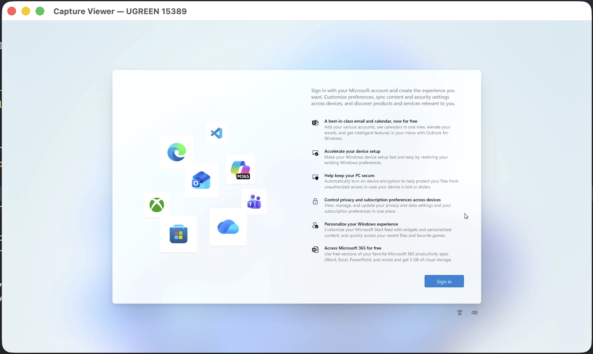
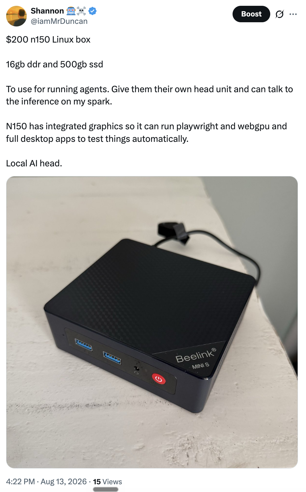

# Capture Viewer

**HDMI in. Pixels and sound out. Nothing else.**

Capture Viewer is a deliberately tiny macOS viewer for HDMI/USB capture cards. It
uses the native, hardware-accelerated AVFoundation preview path, keeping video
frames out of application-managed buffers. No webview, no FFmpeg, no GStreamer,
no recording pipeline, and no feature pile-up.



## Why this exists

I bought a few small N150 mini PCs and wanted to set them up to run headless. A
cheap USB-C HDMI capture card and a wireless keyboard with a built-in trackpad are
all I need to turn my Mac into a temporary setup console: connect the mini PC,
finish the initial setup, enable remote access, then unplug everything and let it
run headless.

I did not want to launch QuickTime or install an entire OBS production studio just
to see an HDMI input. I wanted one tiny app that opens fast, lets me choose a
capture card, shows the picture, plays the sound, and gets out of the way. So I
built exactly that in Rust.

### The N150 that started it

<a href="https://x.com/iamMrDuncan/status/2088013372809732181">
  
</a>

[View the original post on X →](https://x.com/iamMrDuncan/status/2088013372809732181)

## Tiny by design

| Metric | Result |
| --- | ---: |
| Release executable | **297 KiB** (304,160 bytes) |
| Signed `.app` bundle | **324 KiB** |
| Third-party Rust crates | **0** |
| App-managed video frame buffers | **0** |
| Live resident memory (RSS) | **~80–86 MiB** |
| Live macOS physical footprint | **165 MB** |
| CPU while actively previewing | **~1.6–4.2%** |
| Threads while actively previewing | **23** |

The release executable is less than half the size of the screenshot above. The
only dynamic dependencies are macOS system libraries and the native AppKit,
QuartzCore, and AVFoundation frameworks already on the machine.

Runtime figures are from a representative `cargo run` debug session on Apple
Silicon while viewing a mini PC through a UGREEN 15389 capture card. RSS is the
narrower process-resident measurement; macOS physical footprint also counts native
AVFoundation, Core Animation, IOSurface, and GPU-backed graphics memory. Resolution,
frame rate, capture hardware, and macOS version will move these numbers. Capture
Viewer itself does not copy, transform, encode, record, or retain incoming frames.

## Build

Requires macOS 12 or newer, Xcode Command Line Tools, and Rust.

```sh
./scripts/build-app.sh
open "target/release/Capture Viewer.app"
```

The first launch asks for Camera and Microphone permission. Select a capture card
with **File > Source**. HDMI audio is paired automatically when macOS reports the
audio and video devices as linked; **File > Audio Source** provides a manual choice
for inexpensive cards that expose unrelated USB device names. **File > Refresh
Sources** rescans after plugging in hardware (hot-plug events also rescan).

The window can be resized freely. When the capture source changes resolution, the
window snaps to the new aspect ratio automatically. Some HDMI sources keep sending a
fixed 16:9 signal and pad other resolutions with black bars; Capture Viewer samples
occasional frames to detect and crop that padding without copying or retaining the
frames. Manual window sizes preserve the active picture's aspect ratio and are
letterboxed when necessary. Audio goes directly to the current default macOS output.

For development, `cargo run` also works; the usage descriptions are embedded in the
Mach-O binary by `build.rs`.
